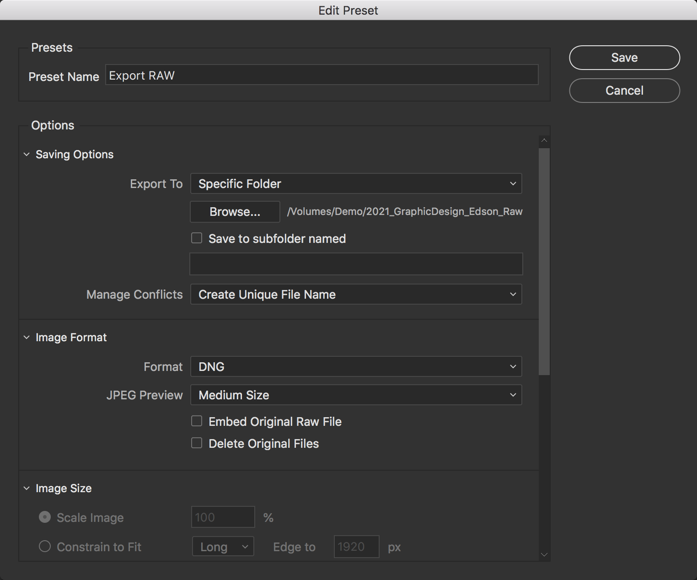

# Thesis Documentation Workshop – pt. 2

## Wesleyan Art Studio 2021

Seamus Edson (he/him) – Graphic Design 2018

sedson@welseyan.edu – if you have questions or issues!

## File Requirements

#### Format and Quantity

- Up to 10 images in a RAW format (CR2, NEF, RAW, DNG are all OK).
- Up to 10 processed JPEGs, 4000 pixels on the long side (Adobe RGB color space preffered)
- If indicated by your advisor, please also submit time-based or interactive work in a format relevant to your particular medium.
- For additional information on supported time-based or interactive work file types, please contact wesscholar@wesleyan.edu

#### Naming Convention

Year_Medium_LastName_ImageNumber

#### Submission Link

[Submit Here](https://docs.google.com/forms/d/e/1FAIpQLSdTEo5e4PZmV98Fhplg8aZ9mg9BBXnt0_P0BGS3t8pmUVqBmw/viewform)


## Overview

1. Managing files with Finder or Bridge
1. Basic Editing and Color Correcting in Photoshop
1. Resizing and Exporting from Photoshop


## 1 – Managing Files

Organizing your files will make things go smoother. You can do this with either Finder or Adobe Bridge, but Bridge is faster. The goal here is to have build a folder structure something like this:

```
📁 Thesis_Documentation
├── 📁 Source
    ├── 📷 DSCF0738.RAF
    ├── 📷 IMG_7435.CR2
    ...

└── 📁 2021_GraphicDesign_Edson_Raw
    ├── 📷 2021_GraphicDesign_Edson_01.RAF
    ...
    ├── 📷 2021_GrapicDesign_Edson_10.dng

└── 📁 2021_GraphicDesign_Edson_Processed
    ├── 🖼️ 2021_GraphicDesign_Edson_01.jpg
    ...
    ├── 🖼️ 2021_GraphicDesign_Edson_10.jpg

└── 📁 Working_Files
    ├── 🖼️ 2021_GraphicDesign_Edson_01.psd
    ...
    ├── 🖼️ 2021_GraphicDesign_Edson_10.psd
```

### With Adobe Bridge

1. Gather all your raw photos in a single place (on a memory card or external drive if working on a lab machine). I wish had made (at least) two copies of this drive! I put all my thesis photos on one memory card which I lost on move out day – so about half of my orignal photo files are gone.
1. Create a folder for your raw selects and for your edited selects
1. Open Adobe Bridge and navigate to your working location – ex: `Computer > MemoryCard > Thesis > Photos`
  - Make sure you are in the `Essentials` works space (top center)
1. Drag this folder onto the `Favorites` area so you can access it quickly
1. Find the `Collections` tab (middle left) and right click to create a new collection
1. Add photos to your collection with drag and drop
1. Can play around with using the star ratings and filters to narrow down photos
1. Once you have the 10ish photos in your collection you have 2 options to export:
  - find the `Exports` tab and `Create a New Preset` with these setings :
  
  - Create a new
1.  


### Resources

[Setting Color Space to Adobe RGB](https://www.photoshopessentials.com/basics/color-settings/)
